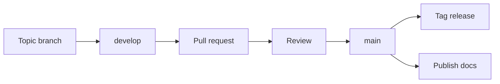

# Project ATLAS — Project Charter

> Internal charter and source of context for Project ATLAS.
> This document is the project's memory. Any contributor — human or AI — should
> read it first. When guidance here conflicts with a chat conversation, this
> document and the Git history win.

---

## 1. Mission

Build **Project ATLAS**: a long-term, Git-based knowledge base and portfolio that
documents the journey toward becoming an **Enterprise AI Platform Architect**.

ATLAS is treated as a real open-source engineering project, not a notebook. It
optimizes for **production AI systems**, not tutorials, and encodes its own
standards so that the repository — not any single conversation — is the source of
truth.

## 2. Objectives

- Produce an opinionated, durable body of architecture knowledge on building and
  operating enterprise AI platforms.
- Serve as a working portfolio that demonstrates architect-level judgment:
  trade-offs, failure modes, and production concerns — not demos.
- Stay tool-agnostic. The repository encodes conventions so ATLAS remains
  consistent across ChatGPT Web, ChatGPT in VS Code, GitHub Copilot, and future
  AI agents.
- Grow through small, reviewable increments (pull requests), each leaving `main`
  publishable.

## 3. Audience

Written for a technical, senior reader:

- Senior and staff software engineers
- Solution, platform, and enterprise architects
- Engineering leaders and CTOs evaluating AI platform decisions

Assume the reader understands distributed systems, cloud, and CI/CD. Do not
explain fundamentals; explain trade-offs, boundaries, and production consequences.

## 4. Writing Style

Concise, practical, and opinionated. Draw inspiration from:

- Microsoft Learn and the Azure Architecture Center
- AWS Prescriptive Guidance
- Martin Fowler
- Thoughtworks Technology Radar

Rules of the house style:

- Lead with the decision, then the rationale.
- Prefer prose that takes a position over neutral surveys.
- Prefer Mermaid diagrams over binary images.
- Reference official documentation where it strengthens a claim.
- No placeholders, no `TODO`s, no filler. If it isn't ready, it isn't committed.

### The seven questions

Every **knowledge document** in ATLAS must answer these, in order:

1. What is it?
2. Why does it matter?
3. When should I use it?
4. When should I avoid it?
5. How does it fit into an Enterprise AI Platform?
6. How does it apply to Cavosh Innovation?
7. How would I explain it in an interview?

Meta and governance files (for example `README.md`, `LICENSE`, `CONTRIBUTING.md`,
`CHANGELOG.md`, `mkdocs.yml`, ADRs) are exempt from the seven questions; they
follow their own established formats.

**Cavosh Innovation** is the reference enterprise used throughout ATLAS. Question 6
grounds abstract guidance in a concrete organizational context: how the concept
would be adopted, governed, and operated for a real enterprise rather than
discussed in the abstract.

## 5. Technology Choices

ATLAS is Azure-first and framework-pragmatic. The current adopted set:

- **Microsoft Agent Framework** — primary agent orchestration
- **LangGraph** — graph-structured, stateful agent workflows
- **Model Context Protocol (MCP)** — tool and context integration standard
- **Azure AI** — models, search/retrieval, and platform services
- **Promptfoo** — evaluation and regression testing of prompts and models

The authoritative, versioned view of what is adopted, trialed, assessed, or held
lives in the Technology Radar (`docs/03-Technology-Radar.md`). This section names
the defaults; the Radar records the movement over time.

## 6. Repository Conventions

- **Git is the source of truth.** Decisions live in the repository, not in chat.
- **Documentation-first.** The docs are the product; code exists to support them.
- **Documentation as code.** Docs are versioned, reviewed, and published from the
  repository like any other artifact.
- **Architecture Decision Records.** Significant decisions are captured as ADRs in
  `adr/`, using the project ADR template. Prefer an ADR over a long discussion.
- **Static site.** Documentation is published with **Material for MkDocs**; the
  navigation is defined in `mkdocs.yml`.
- **Changelog.** `CHANGELOG.md` follows *Keep a Changelog*; versions follow
  Semantic Versioning.
- **Diagrams.** Prefer Mermaid, kept inline in Markdown so diagrams are diffable.

### Repository layout

```
atlas/
├─ PROJECT.md          # Internal charter (this file) — the project's memory
├─ README.md           # Public front door
├─ ROADMAP.md          # 12-month roadmap
├─ CHANGELOG.md        # Keep a Changelog + SemVer
├─ mkdocs.yml          # Material for MkDocs site configuration
├─ docs/               # Published knowledge base (the seven-question docs)
├─ adr/                # Architecture Decision Records
├─ getting-started/    # Runnable examples (e.g. Promptfoo evaluation)
└─ .github/            # Repository automation and AI guidance
```

## 7. Roadmap

ATLAS follows a 12-month, quarterly roadmap. The authoritative version is
`ROADMAP.md`; the summary:

| Quarter | Theme | Focus |
|---|---|---|
| Q1 | Foundations | AI-300, Azure AI, Retrieval-Augmented Generation |
| Q2 | Quality | Evaluation, guardrails |
| Q3 | Operations | Observability, agent-to-agent (A2A) systems |
| Q4 | Platform | Platform engineering and portfolio consolidation |

## 8. Definition of Done

A change is **done** when, as applicable to its type:

- **Documentation** is complete and answers the seven questions (for knowledge
  docs), with no placeholders or `TODO`s.
- A **diagram** is included where it clarifies structure or flow (Mermaid).
- An **ADR** records any significant or non-obvious decision the change embodies.
- Navigation (`mkdocs.yml`) and `CHANGELOG.md` are updated when the change adds or
  moves published content.
- The docs site builds cleanly.

## 9. Release Strategy

- Feature work happens on a **`develop`** branch (and short-lived topic branches).
- Changes reach **`main`** through **pull requests** that are reviewed and squashed
  or merged cleanly.
- `main` is always publishable; documentation is published from `main`.
- Releases are **tagged** and recorded in `CHANGELOG.md` following Semantic
  Versioning.

Workflow:



## 10. How to Use This Charter

- **Start every AI session by reading `PROJECT.md`.** It restores ~90% of project
  context without replaying past conversations.
- Keep it current: when a durable decision changes, update this file in the same
  pull request (and add an ADR if the decision is significant).
- Treat it as the contract every contributor works from. If a prompt and this
  charter disagree, the charter wins.
