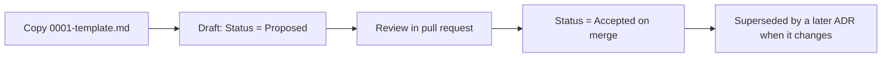

# Architecture Decision Records

This directory holds the **Architecture Decision Records (ADRs)** for Project
ATLAS. An ADR captures a single significant decision — its context, the choice
made, and the consequences — so the reasoning survives long after the discussion
that produced it.

ATLAS prefers an ADR over a long discussion. If a decision is significant or
non-obvious, it belongs here.

## Conventions

- One decision per record. Records are immutable once **Accepted**.
- To change a past decision, add a new ADR and set the old one's status to
  **Superseded by ADR-NNNN**. Do not rewrite history.
- Files are named `NNNN-kebab-case-title.md`, numbered sequentially from `0002`.
- New records start from [`0001-template.md`](0001-template.md).

## Index

| ADR | Title | Status |
|---|---|---|
| [0001](0001-template.md) | ADR template | — (template) |
| [0002](0002-record-architecture-decisions.md) | Record architecture decisions | Accepted |

## Workflow

