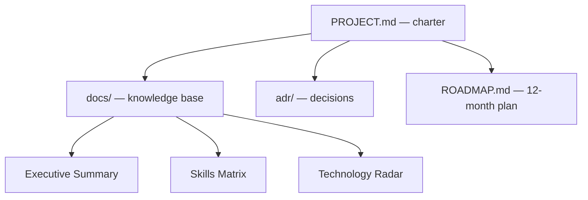

# Project ATLAS

**An Enterprise AI Platform Architect Playbook.** ATLAS is a documentation-first
knowledge base and portfolio on building and operating production AI platforms —
written for senior engineers and architects, and optimized for reliability,
security, evaluation, observability, cost, and governance rather than tutorials.

The Git repository is the source of truth. Every document is versioned, reviewed,
and published from `main`.

## How to read this site

Every knowledge document answers the same seven questions, in order — so you can
scan for exactly the angle you need:

1. What is it?
2. Why does it matter?
3. When should I use it?
4. When should I avoid it?
5. How does it fit into an Enterprise AI Platform?
6. How does it apply to Cavosh Innovation?
7. How would I explain it in an interview?

Questions 3 and 4 carry the architectural judgment; question 6 grounds the
concept in a concrete enterprise context; question 7 makes the material portable
to an interview or design review.

## Start here

| If you want to… | Read |
|---|---|
| Understand the project's intent and conventions | [Executive Summary](01-Executive-Summary.md) |
| See the current vs. target capability map | [Skills Matrix](02-Skills-Matrix.md) |
| Know which technologies are adopted, trialed, or held | [Technology Radar](03-Technology-Radar.md) |

## How ATLAS is organized

The roadmap advances quarterly: **Q1** foundations (AI-300, Azure AI, RAG),
**Q2** quality (evaluation, guardrails), **Q3** operations (observability,
agent-to-agent systems), and **Q4** platform engineering and portfolio
consolidation.

